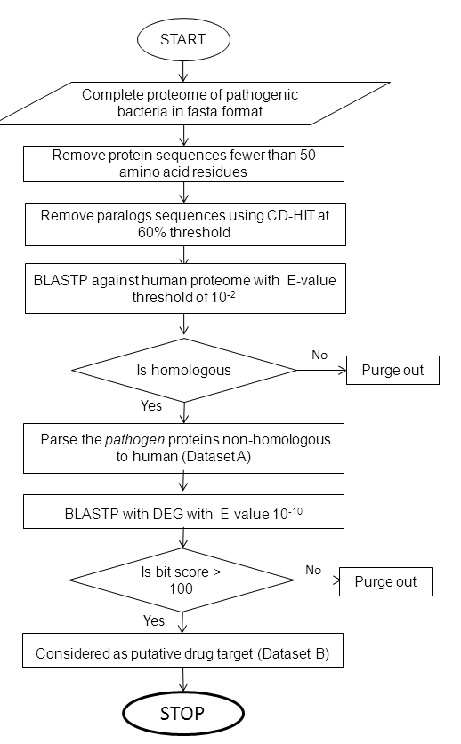

# EDTI: Exogeneous drug target identification tool

##About
The availability of complete genome sequences of pathogenic bacteria and their protein complements in public domain has made it possible to determine potential drug targets in these pathogens using computer-based in-silico techniques. Intersection of two datasets, namely 
[i] a pathogen's subtractive proteome dataset with the host proteome, and 
[ii] the pathogen's minimal essential protein dataset, should represent a set of proteins whose manipulation may reasonably be expected to interfere with the pathogen's survival without adversely affecting the host. 

These proteins could thus act as potential targets for drugs acting against the particular pathogen.

##Citation

## PERL implementation
Active Perl is used to develop the tool. 
## System requirements
Currently supports only Windows XP/7/8.

## Dependacies
The tool need Perl (www.perl.org) to be installed on your local computer. We reccommnend to install Activeperl (v. MSWin32-x86-64int) as most of the modules used by EDTI come bundled with ActivePerl distribution. 
However, following modules are need to be installed additionally from cpan.
* Graph (To install open command prompt and type : <i>cpan install Graph</i>)

## External softwares required
* NCBI Blast (v. 2.2.18): blastall.exe <a href='ftp.ncbi.nlm.nih.gov/blast/executables/release/LATEST/' target='_blank'> Download </a>
* CD-Hit (v.4.6 tested on MinGw-w64): cd-hit.exe  [See below for detailed stpes describing how to Compile on Windows]
<a href='https://github.com/weizhongli/cdhit' target='_blank'>cd-hit github</a>

* Sqlite (v. 3) : sqlite3.exe <a href='https://www.sqlite.org/download.html' target='_blank'>Download</a>
* formatdb (v. 2.2.18): formatdb.exe  [install BLAST+]

###Complie cd-hit source into Win32 executable.
1. Download the cdhit-master.zip file from https://github.com/weizhongli/cdhit
2. Extract the zip file and Open the folder cdhit-master.
3. open 'Makefile' file in notepad  and in the third line add '-static'  ( CC = g++ -static  ). Save the file.

> Compile cd-hit source using Mingw-w64

1. Download and install mingw-w64 from http://sourceforge.net/projects/mingw-w64/files/latest/download
2. Go to  C:\Program Files\mingw-w64\x86_64-5.2.0-win32-seh-rt_v4-rev1 directory (depends on your OS path). and Double click on mingw-w64.bat file.
3. On COmmandline go to the cdhit-master directory. 
 1. on Modern OS (supporting threading)like Windows-7,8,8.1 or 10: Run command 'mingw32-make '.  
 2. On older OS like Win-XP : : Run command 'mingw32-make openmp=no '.
 3. This should run fine and output cd-hit.exe. 
4. Now copy the cd-hit.exe to executable folder. 

## Changes and bug fixes
* PPI data integration
* First version stable: June 12, 2015
* Wed, Dec 02, 2015  2:41:40 PM : Broadspectrum analysis, BLAST known target_databases added;
* Fri, Dec 04, 2015  4:20:21 PM : File path problem solved; Param seting s for Downstream anal addedi;
* Sat, Dec 05, 2015 9:29:32 PM : Broad spectrum analysis Settings; select pathogens based on taxonomy based selection;
* Mon, Dec 07, 2015 12:13:11 PM : few path issues corrected
* Fri, Dec 11, 2015  4:22:00 PM : GO enrichment analysis added
* Sat, Dec 12, 2015  12:30:03 AM : Utilities menu added;
* Mon, Dec 14, 2015  10:45:00 PM : Sub-cellular localization;pSORT web-based added;
* Tue, Dec 15, 2015  17:07:33 PM : GO enrich add datababase Utility;
* Wed, Dec 16, 2015  02:11:53 AM : Executables in ENV PATH; NCBI tax id added; code fix update
* Wed, Dec 16, 2015  07:11:01 PM : Major code fix; responsive Dialogs-box; broad spectrum cmd toolong fixed;near finish
* Thr, Dec 17, 2015  07:34:12 PM : v.1.2.1 beta
* Fri, Dec 18, 2015  04:52:12 PM : stable v.1.2.1b (beta); BLAST path contingin space not accepted;
* Mon, Dec 21, 2015  11:54:12 AM : stable v.1.2.2b (beta); BLAST+ Supported;

## Futures supported/proposed
- [ ] Single project should contain all outputs
  - [x] Import all inputs to create a single project
  - [x] All outputs in the same project
  - [ ] Import a runned project to rerun a uncomplete task
  - [x] Single sciprt must be sufficient to use
- [x] Putative Bactrial Drug targets
 - [x] Single-copy genes (CD-hit) + Non-host proteins(BLAST) + Essntial proteins (BLAST vs DEG)
 - [x] Single-copy genes (CD-hit) + Non-host proteins (BLAST) + Hub genes via Protein-protein interaction analysis (STRING)
- [ ] Downstream annotation of Targets.
 - [x] Broadspectrum analysis
 - [x] Compare against Known target databases
 - [x] Gene Ontology Enrichment
 - [ ] Pathway enrichment
 - [x] Sub-cellular localization prediction
- [x] Utility to create inputs
 - [x] create PPI networks from STRING dataset
 - [x] Create Drug traget database
 - [x] create Broadspectrum analysis database
 - [x] create Go annotation (Ecoli)
- [ ] Create help doc
 - [x] MS Word Documnet
 - [ ] PDF Doc
 - [ ] HTML version
- [ ] OS dependancy
 - [x] Windows Version
 - [ ] Unix Version
- [ ] External binary executables on PATH
 

